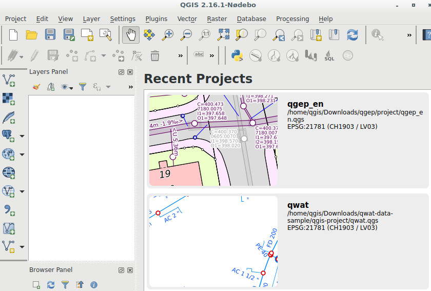

*********
Demo data
*********

You can play around with demo data by either recreating a qWat setup on your machine or by using a demo vm.

QWAT data sample
================

How to install the data sample from the qWAT water distribution management project.

.. note::

 The install guide mainly presents how to restore the data sample from **GNU/Linux**.
 There are some suggestions on how to do it under **Windows** but if you feel you're in too deep
 you may checkout the next chapter and download the Demo VM.

.. note::

 If you're on **Windows 10** it has a new feature which permits running the  **Linux Bash Shell**
 and you can easily do all the steps outlined here while getting accustomed the Linux Shell.

Install guide
-------------

**Create database**

Create a database named **qwat**.

You can do this either by using **pgAdmin** or using the command line, e.g.::

 psql -U postgres -c 'create database qwat;'
 psql -U postgres -d qwat -c 'create extension postgis;'
 psql -U postgres -d qwat -c 'create extension hstore;'

**Create the data model and download the sample**

Get the repositories::

 git clone https://github.com/qwat/qWat
 git clone https://github.com/qwat/qwat-data-model
 git clone https://github.com/qwat/qwat-data-sample

.. note::

 If you don't like using git in the command line you can always go to the above links
 and press the **Clone and download** button then the **Download zip** one and extract
 the archives afterwards.

Create the QWAT database model with roles::

 cd qwat-data-model && git submodule update --init --recursive
 ./init_qwat.sh -p qwat -s 21781 -d -r

You now have the neweset data model (without sample data) + database roles.

**Create the qwat service in the ``.pg_service.conf`` file**

If you already have the service defined you can skip this step.

You can use the following command in linux::

 echo "# Qwat service name
 [qwat]
 #enter your database ip
 host=127.0.0.1
 #database name
 dbname=qwat
 port=5432
 user=postgres
 #you can also add your password if you like
 password=YourPassword" >> ~/.pg_service.conf 

If you just want to run the data model (without the sample data) you can simply open the **qwat.qgs** project from the qWat directory.

**Restore the sample data**

First drop the latest qwat model as the sample data may not match the latest structure::

 cd ../qwat-data-sample
 psql -U postgres -d qwat -c ' drop schema qwat_dr cascade;'
 psql -U postgres -d qwat -c ' drop schema qwat_od cascade;'
 psql -U postgres -d qwat -c ' drop schema qwat_sys cascade;'
 psql -U postgres -d qwat -c ' drop schema qwat_vl cascade;'

Restore the sample data model using pgadmin or with command below::

 git remote add upstream https://github.com/tudorbarascu/qwat-data-sample
 git pull upstream master

 psql -U postgres -d qwat -f 201600302_plain_qwat.backup

**Open the qgis project**

You can open the **qwat.qgs** project from the qwat-data-sample directory and you should see this screen:

.. image:: img/qgis.png

.. note::

 You can also try out the latest **qwat.qgs** project from the qWat directory. Keep in mind that there there's a chance
 that it doesn't fit the sample data model. This is because the sample data model may be a little older than the latest
 data model and only the corresponding **.qgs** project has been matched.

Demo Virtual Machine
====================

This represents a guide on how to download and install a virtual machine (VM) that has a working QWAT installation
with a demo dataset. The VM also has a working demo of the `QGEP waste-water project <http://github.com/QGEP/QGEP>`_.

**About**

The VM is based on Debian Testing with Cinnamon Desktop.
Debian Testing was chosen in order to have GDAL 2.x and also benefit from latest linux kernel so that latest hardware
won't be a problem for the case where the VM is used outside virtualization (e.g use the virtual disk as basis to create
a non-virtualized usb-stick to be used for demo purposes).

Installed software:

- PostgreSQL 9.5.2 with Postgis 2.2.2
- QGIS 2.16

Settings that are changed from a default software install:

- ``pg_hba.conf`` has ``trust`` for local connections
- QGIS is setup with `multithreaded rendering enabled <http://www.lutraconsulting.co.uk/products/qgis-mtr>`_

.. note::

 The users ``qgis`` and ``root`` have the password ``qgis``. You should login with the ``qgis`` user.

.. note::

 QGIS has been build from source as Debian developpers have dropped QtWebKit python support in the packages.
 After the QGIS ecosystem will remove its QtWebKit dependencies the VM will benefit again from the QGIS repo packages.

If you decide to use the VM in production, it is recommended to:

- change the passwords
- regenerate the ssh keys by running in a terminal: ``sudo rm /etc/ssh/ssh_host_* && sudo dpkg-reconfigure openssh-server``

**Download**

Download the vm from http://docs.qtibia.ro/qgis.vdi.xz

.. note::

  The size of the VM is around 4GB compressed and up to 15GB uncompressed.

**Extract**

The virtual disk is archived using XZ compression.

To extract the archive:

- **Windows:** you can use `7-Zip <http://7-zip.org/>`_ to extract the archive.
- **Linux:** cd to the download directory and run ``xz -d qgis.vdi.xz``

You can run the VM as you would do with any VirtualBox VM.

.. note::

 As the VM is based on Linux it is fairly simple to convert the image to a raw disk
 and put it on a USB stick (minimum 16GB) or a faster storage. This would enable you
 to run the app without the virtualization penalty and enjoy the full speed of your hardware.

**Run QWAT**

After logging in with ``qgis`` user and the same password, by  clicking the QGIS icon located in the bottom bar
you will get the following image:

Clicking the **qwat** project and following the :ref:`user-guide` should get you started.

