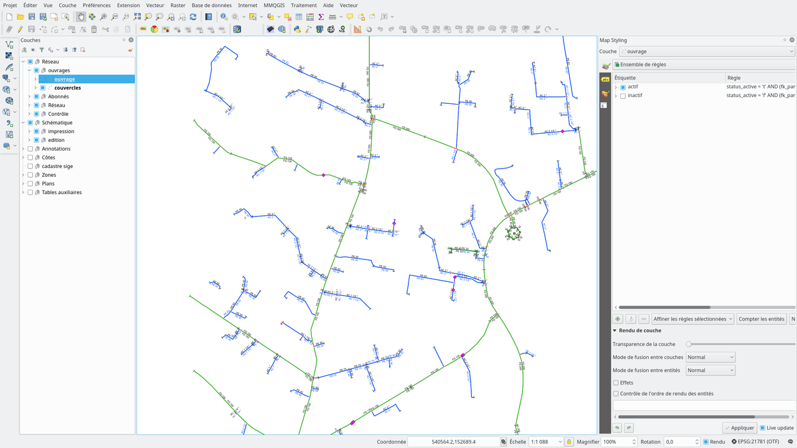

*********************
Demo data and project
*********************

QWAT can be tested by downloading the QGS project repository `here <https://github.com/qwat/QWAT>`_` and restoring the latest full data dump in postgreSQL (+ extension postGIS and hstore)  `here <https://github.com/qwat/qwat-data-sample>`_.

More detailed instructions:

How to install the data sample from the qWAT water distribution management project.

.. note::

 The install guide mainly presents how to restore the data sample from **GNU/Linux**.
 There are some suggestions on how to do it under **Windows** but if you feel you're in too deep
 you may checkout the next chapter and download the Demo VM.

Create the QWAT database model with roles::

 cd qwat-data-model && git submodule update --init --recursive
 ./init_qwat.sh -p qwat -s 21781 -d -r

You now have the neweset data model (without sample data) + database roles.

**Create the qwat service in the ``.pg_service.conf`` file**

If you already have the service defined you can skip this step.

You can use the following command in linux::

 echo "# Qwat service name
 [qwat]
 #enter your database ip
 host=127.0.0.1
 #database name
 dbname=qwat
 port=5432
 user=postgres
 #you can also add your password if you like
 password=YourPassword" >> ~/.pg_service.conf

If you just want to run the data model (without the sample data) you can simply open the **qwat.qgs** project from the qWat directory.

**Restore the sample data**

First drop the latest qwat model as the sample data may not match the latest structure::

 cd ../qwat-data-sample
 psql -U postgres -d qwat -c ' drop schema qwat_dr cascade;'
 psql -U postgres -d qwat -c ' drop schema qwat_od cascade;'
 psql -U postgres -d qwat -c ' drop schema qwat_sys cascade;'
 psql -U postgres -d qwat -c ' drop schema qwat_vl cascade;'

Restore the sample data model using pgadmin or with command below::

 git remote add upstream https://github.com/tudorbarascu/qwat-data-sample
 git pull upstream master

 pg_restore --dbname qwat -e --no-owner --verbose --port 5432 qwat_data_sample.backup

**Open the qgis project**

You can open the **qwat.qgs** project from the qwat-data-sample directory and you should see this screen:

.. note::

 You can also try out the latest **qwat.qgs** project from the qWat directory. Keep in mind that there there's a chance
 that it doesn't fit the sample data model. This is because the sample data model may be a little older than the latest
 data model and only the corresponding **.qgs** project has been matched.
