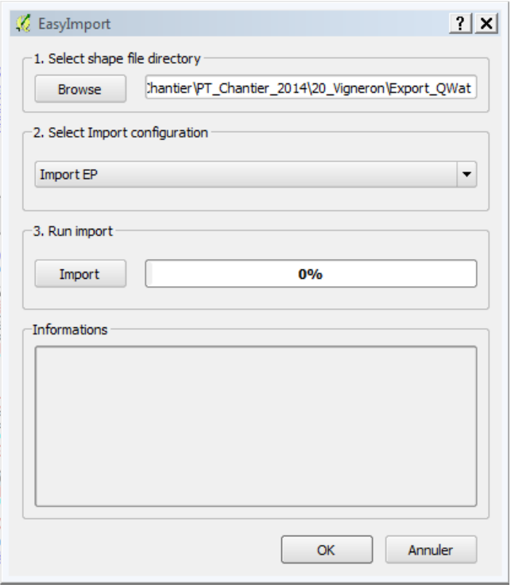
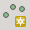
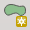
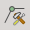
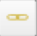
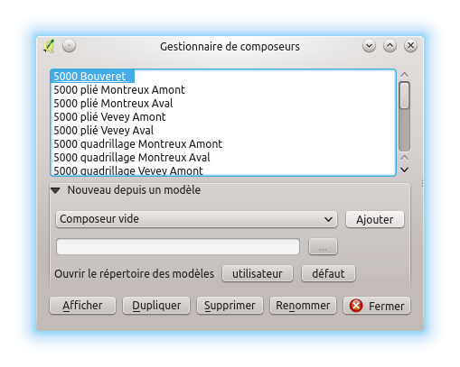

.. _user-guide:

*************
Utiliser QWAT
*************

Comment utiliser QWAT ?

1. Règles de base pour la mise à jour sur QWAT
==============================================

* A chaque entité créée ou supprimée, enregistrez pour voir si un message d’erreur apparait et ainsi pouvoir résoudre ces erreurs de saisie beaucoup plus facilement sans devoir chercher sur quel objet se trouve quelle erreur!
* Quand vous changez de catégorie d’objet, n’oubliez pas de fermer le mode édition des autres catégories et s’assurer ainsi que tout a été mis à jour avant d’aller plus loin!
* Comme tout programme informatique, n’oubliez pas d’enregistrer régulièrement votre projet!

1.1 Commandes de base
---------------------

* Pour créer de nouveaux objets, utilisez le bouton « basculer en mode édition »

  .. image:: img/icon_edit.png

  * Si c’est une catégorie de type point, vous aurez le symbole suivant:

    .. image:: img/icon_create_point.png
  
  * Si c’est une catégorie de type ligne, vous aurez le symbole suivant:

    .. image:: img/icon_create_line.png

  * Enfin, si c’est une catégorie de type polygone, vous aurez le symbole suivant:
  
    .. image:: img/icon_create_polygon.png

* Pour enregistrer les dernière modifications de la catégorie sélectionnée uniquement, cliquez sur le bouton « sauvegarder les modifications ».

  .. image:: img/icon_edit_save.png

* Pour ouvrir les différents masques de nos objets, utilisez le bouton « identifier les entités ».

  .. image:: img/icon_identify.png

* Pour sélectionner des objets, utilisez le bouton

  .. image:: img/icon_select.png

* Pour désélectionner des objets, utilisez le bouton

  .. image:: img/icon_unselect.png

* Pour supprimer les objets sélectionnés, utilisez le bouton

  .. image:: img/icon_delete.png

2. Structuration du réseau d’Eau Potable sur QWAT
=================================================

2.1 Ordre de saisie des différents type d’objets
------------------------------------------------

La mise à jour sur QWAT se fait dans l’ordre suivant:

* 1) Points de construction: Pour tous les:

    * points de construction
    * Té
    * Bouchon
    * Changement de matériau
    * Changement d’année
    * Changement de diamètre

* 2) Création des conduites: Pour toutes les:

    * Conduites principales (réseau)
    * Conduites hydrantes
    * Conduites de branchement
    * Conduites de branch. secondaire
    * Conduites de transport
    * Conduites d’arrosage

* 3) Création des pièces d’installation: Pour tous les:

    * Croix
    * Changement de pente
    * Coude
    * Manchon
    * Collier de prise
    * Bouchon
    * Bouches d’arrosage
    * Autres pièces diverses

* 4) Création des points d’introduction: Pour tous les: 

   * Points d’introduction

* 5) Création des vannes: Pour toutes les:

    * Vannes réseau
    * Vannes hydrant
    * Vannes de prise
    * Vannes de prise secondaire
    * Vannes de régulation
    * Purge
    * Vannes de vidange automatique
 
* 6) Création des bornes hydrantes: Pour toutes les:
 
    * Bornes hydrant
 
* 7) Création des manchons de réparation: Pour tous les:

    * Manchon de réparation

* 8) Création des ouvrages: Pour tous les:

    * Ouvrages

 
2.2 Directive de saisie des conduites   
-------------------------------------

.. warning:: CETTE PARTIE EST SUSEPTIBLE DE CHANGER EN FONCTION DU DEVELOPPEMENT DE QWAT !

La saisie du réseau doit être effectuée en respectant les directives fixées par SIRE, selon les exemples ci‐après.

.. image:: img/SIRE.png

3. Création d’objets dans QWAT
==============================

3.1 Importation des points relevés
----------------------------------

Pour importer des points dans QWAT, il faut cliquer sur l’icône « EasyImport »

.. image:: img/icon_plugin.png
 
La fenêtre suivante s’ouvre :

* Choisir le chemin du fichier à importer
* Choisir le bon réseau (EP‐ASS)
* Cliquer sur « Import »

Les points ont été importés dans les bonnes couches, ces dernières sont passées en mode édition.
Vous devez maintenant remplir les attributs des différents points pour chaque couche en suivant la marche à suivre.

3.2 Création des points de construction
---------------------------------------

Pour créer de nouvelles pièces d’installation il faut sélectionner la catégorie
« points de construction » qui est une sous‐couche dans la couche « Côtes ». 
Il faut ensuite basculer en mode édition

.. image:: img/icon_edit.png

et utiliser le bouton « ajouter une entité »

Il ne reste plus qu’à cliquer à l’emplacement du point voulu.
Le masque de l’objet s’ouvre, il n’y a aucun champ à remplir.
(Vous pouvez mettre une remarque éventuellement)
 

3.3 Création des conduites
--------------------------

Pour créer de nouvelles conduites il faut sélectionner la catégorie « conduites »
qui est une sous‐couche dans la couche « Réseau ». Nous devons ensuite basculer en mode édition

.. image:: img/icon_edit.png

et utiliser le bouton «ajouter une entité»

.. image:: img/icon_create_line.png

Digitaliser ensuite la conduite et faites un clic droit pour la valider
une fois tous les points de passage créés.
 
Le masque de la conduite s’ouvre, il faut remplir les champs suivants:

* Onglet Général
    * Distributeur
    * Année
    * Fonction
    * Statut
    * Matériau
    * Mode de pose
    * Protection
    * Lit de pose (matériau)
* Hydraulique
    * Qualité eau
* Géométrie
    * Précision
* Rendu
    * « Schématique » à cocher si on veut que la conduite apparaisse sur la schématique
* Fuites
    * Liaison avec les manchons de fuites à faire si besoin (cf partie sur les fuites)

3.3.1 Séparation d’une conduite en deux conduites
-------------------------------------------------

Lors d’une mise à jour, il arrive régulièrement que l’on doive couper une conduite existante
pour se raccorder sur le nouveau point levé. Pour se faire, il faut utiliser l’outil « Séparer les entités »

.. image:: img/icon_cut_entity.png

Il faut ensuite faire une droite coupant notre conduite à l’endroit où l’on veut que notre conduite se fasse couper:

.. image:: img/cut_entity.png

La conduite se coupe alors en deux conduites. Les champs n’ont pas besoin d’être complété,
la nouvelle conduite reprend les même attributs, juste le numéro d’ID de la conduite qui
est créé automatiquement.

3.4 Création des différentes pièces d’installation
--------------------------------------------------

Pour créer de nouvelles pièces d’installation il faut sélectionner la catégorie
« pièce d’installation » qui est une sous‐couche dans la couche « Nœuds ».
Il faut ensuite basculer en mode édition.

.. image:: img/icon_edit.png

et utiliser le bouton « ajouter une entité »

Il ne reste plus qu’à cliquer à l’emplacement du point voulu.
Le masque de l’objet s’ouvre, il faut remplir les champs suivants:

* Identification (numéro du point levé)
* Année
* Orientation (de la pièce)
* Type
* Statut

3.5 Création des points d’introduction
--------------------------------------

Le point d’introduction se crée en créant une pièce d’installation ayant comme
« Type » = « point d’introduction ». Une fois cela fait, un point d’introduction sera
automatiquement crée dans la couche « Nœuds » lors de la génération des nœuds (voir les explications plus bas).

3.6 Création des vannes
-----------------------

Pour créer de nouvelles vannes il faut sélectionner la catégorie « vannes » qui est une
sous‐couche dans la couche « Réseau ». Il faut ensuite basculer en mode édition

.. image:: img/icon_edit.png

et utiliser le bouton « ajouter une entité ».

Il ne reste plus qu’à cliquer à l’emplacement du point voulu.
Le masque de l’objet s’ouvre, il faut remplir les champs suivants:

* Onglet Général
    * Année 
    * Fermée (à cocher si c’est le cas)
    * Type
    * Fonction
    * Statut
    * Maintenance (si défaut)
* Géométrie
    * Altitude réelle (coordonnée Z du point)
    * Précision alti.
    * Précision (planimétrique)
* Rendu
    * Schématique à cocher si on veut que la conduite apparaisse sur la schématique

3.7 Création des bornes hydrantes
---------------------------------

Pour créer de nouvelles bornes hydrantes il faut sélectionner la catégorie « hydrantes »
qui est une sous‐couche dans la couche « Réseau ».

Il faut ensuite basculer en mode édition

.. image:: img/icon_edit.png

et utiliser le bouton « ajouter une entité ».

Il ne reste plus qu’à cliquer à l’emplacement du point voulu.
Le masque de l’objet s’ouvre, il faut remplir les champs suivants:

* Onglet Général
    * Année
    * Distributeur
    * Etat
    * Fournisseur
    * Souterraine (à cocher si c’est le cas)
* Géométrie
    * Altitude réelle (coordonnée Z du point) 
    * Précision alti. 
    * Précision (planimétrique)
* Hydraulique
    * Pression statique
    * Pression dynamique
    * Débit
    * Mesuré le
    * Mesuré par

3.8 Création d’un manchon de réparation
---------------------------------------

Pour créer un nouveau manchon de réparation il faut sélectionner la catégorie « fuites »
qui est une sous‐couche dans la couche « Réseau ».
Il faut ensuite basculer en mode édition

.. image:: img/icon_edit.png

et utiliser le bouton « ajouter une entité ».

Il ne reste plus qu’à cliquer à l’emplacement du point voulu.
Le masque de l’objet s’ouvre, il faut remplir les champs suivants:

* « réparée »
    * à cocher si la fuite est réparée
* détection
    * date de détection de la fuite
* adresse
    * endroit où a eu lieu la fuite
* Description
* Type
    * Type de dégâts
* Cause
    * Cause de la fuite
* Dommage
    * Gravité des dégâts
* « Conduite remplacée »  
    * à cocher si un bout de conduite a été changé
* Réparation
    * Pièce utilisée pour la réparation
* Date réparation

Pour que la liaison avec la conduite se fasse automatiquement, il faut enregistrer
la conduite une fois le manchon crée.

3.9 Création d’ouvrages ainsi que de tous leurs détails
-------------------------------------------------------

Les ouvrages et leurs détails sont contenus dans plusieurs couches:

    * Le points principal se trouve dans la sous‐couche « ouvrage général »
    * Le couvercle de l’ouvrage, si il y en a un, se trouve dans la sous‐couche « couvercle »
    * L’emprise réelle de l’ouvrage se trouve dans la sous‐couche « ouvrage – polygones »
    * Les points de détail des ouvrages (par exemple les vannes d’une chambre de vannes) se trouvent dans la sous‐couche « détail ».

3.9.1 Création de l’ouvrage général
-----------------------------------

Pour créer le point d’ouvrage, il faut sélectionner la catégorie « ouvrage général »
qui est une sous‐couche dans la couche « ouvrages ».  
Il faut ensuite basculer en mode édition

.. image:: img/icon_edit.png

et utiliser le bouton « ajouter une entité ».

Il ne reste plus qu’à cliquer à l’emplacement du point voulu.
Le masque de l’objet s’ouvre, il faut remplir les champs suivants:

* Nom (composé d’une lettre suivi d’un nombre)
* Statut 
* « Visible schéma » à cocher si on veut que la conduite apparaisse sur la schématique
* Année
* Type
 
3.9.2 Création du couvercle de l’ouvrage
----------------------------------------

Pour créer le couvercle de l’ouvrage, il faut sélectionner la catégorie « couvercles »
qui est une sous‐couche dans la couche « ouvrages ».  
Il faut ensuite basculer en mode édition

.. image:: img/icon_edit.png

et utiliser le bouton « ajouter une entité ».

Il ne reste plus qu’à cliquer à l’emplacement du point voulu.
Le masque de l’objet s’ouvre, il faut remplir les champs suivants:

* identification (identique au champ « Nom » de l’ouvrage)
* Diamètre (en mm) 
* Altitude
* Type
* « Circulaire » à cocher si le couvercle est rond
* Ouvrage
    * Il faut lier l’ouvrage principal au couvercle. Pour se faire, cliquez sur le bouton
    
    .. image:: img/icon_link.png
    
    et ensuite aller cliquez sur le point principal de l’ouvrage (sur le plan).
    Le champ a du se remplir avec le nom de l’ouvrage.

3.9.3 Création de l’emprise de l’ouvrage
----------------------------------------

Pour créer le point d’ouvrage, il faut sélectionner la catégorie « ouvrage général »
qui est une sous‐couche dans la couche « ouvrages ».
Il faut ensuite basculer en mode édition

.. image:: img/icon_edit.png

et utiliser le bouton « ajouter une entité ».

Il ne reste plus qu’à digitaliser l’emprise de l’ouvrage. Une fois le polygone crée, faites un clic‐droit pour arrêter la saisie.
Le masque s’ouvre, il faut remplir les champs suivants:

* name (identique au champ « Nom » de l’ouvrage)
* id_type 
* Year

3.9.4 Création des détails de l’ouvrage
---------------------------------------

Pour créer les détails de l’ouvrage, il faut sélectionner la catégorie du détail voulu qui est une sous‐couche dans la couche « détail ».
Il faut ensuite basculer en mode édition

.. image:: img/icon_edit.png

et utiliser le bouton « ajouter une entité ».

Il ne reste plus qu’à cliquer à l’emplacement du point voulu.
Le masque de l’objet s’ouvre, il faut remplir les attributs selon
le type de détail que l’on a créé (réservoirs, sources etc..).

4. Liaisons des différents objets dans QWAT
===========================================

Dans QWAT il n’y a que 2 types de liaison à créer manuellement, à savoir:

* les liaisons parents‐enfants des conduites (Afin de lier 2 conduites adjacentes ayant les même attributs)
* Les liaisons fuites‐conduites (Afin de relier une fuite à la conduite sur laquelle elle se trouve)

4.1 Création des relations parents‐enfants des conduites
--------------------------------------------------------

Pour créer une relation parent‐enfant, il faut sélectionner la catégorie « conduites »
qui est une sous‐couche dans la couche « Réseau ».
Basculer en mode édition.

.. image:: img/icon_edit.png

Sélectionner la conduite enfant (celle qui va reprendre les attributs de la conduite parent) avec le bouton « identifier les entités ».

.. image:: img/icon_identify.png

Le masque de l’objet s’ouvre.
Il faut ensuite aller dans l’onglet « Rendu ». Vous avez un champ « Parent » qui indique le numéro
de la conduite parent, si il y en a une. Pour rajouter une conduite parent, il faut cliquer sur le bouton

.. image:: img/icon_link.png

et ensuite aller cliquez sur notre conduite parent (sur le plan). Le champ parent a du se remplir.

4.2 Suppression des relations parents‐enfants des conduites
-----------------------------------------------------------

Pour supprimer une relation parent‐enfant, il faut sélectionner la catégorie « conduites »
qui est une sous‐couche dans la couche « Réseau ».
Basculer en mode édition

.. image:: img/icon_edit.png

Sélectionner la conduite enfant (celle qui va reprendre les attributs de la conduite parent)
avec le bouton « identifier les entités ».

.. image:: img/icon_identify.png

Le masque de l’objet s’ouvre. Il faut ensuite aller dans l’onglet « Rendu ».
Vous avez un champ « Parent » qui indique le numéro de la conduite parent.
Pour supprimer ce numéro, cliquez sur le  bouton

.. image:: img/icon_del_relation.png

Le numéro a du s’effacer et il doit y avoir à la place « NULL (pas de sélection) ».

4.3 Création des relations fuites‐conduites
-------------------------------------------

Une fois le manchon de réparation crée, il faut faire passer la conduite par ce manchon.
Pour se faire, utiliser « l’outil de nœud »

et double cliquer sur la conduite à un endroit proche du manchon de réparation.
Déplacer le point nouvellement créer avec le même outil. Ouvrir le masque de la conduite,
aller sous l’onglet « fuite » et créer la liaison en activant l’édition de donnée

.. image:: img/icon_edit.png

Cliquer ensuite sur:

Un tableau de toutes les fuites apparait, trouver celle qui nous concerne et sélectionner‐la
en cliquant sur le numéro de ligne correspondant. Cliquer ensuite sur « OK », vous êtes ramenés dans le
masque de la conduite avec normalement le numéro ID du manchon de réparation indiqué en rouge.

Désactiver ensuite l’éditeur de donnée, on vous demande si vous voulez sauver les modifications
de la couche « fuites ». Cliquer sur enregistrer. Le numéro doit être passé en noir.

5. Suppression d’objets dans QWAT
=================================

.. warning:: Pour supprimer une conduite, il faut commencer par supprimer tous les points liés à cette conduite.

5.1 Suppression des pièces d’installation / points d’introduction / vannes / bornes  hydrantes / manchons de réparation et conduites
------------------------------------------------------------------------------------------------------------------------------------

Commencer par aller sur la couche de l’objet que vous voulez effacer et basculer en mode édition.

.. image:: img/icon_edit.png

Sélectionner ensuite le point avec l’outil de sélection. Vous pouvez soit faire une zone
de sélection ou tout simplement cliquer sur le point à effacer.

.. image:: img/icon_select.png

.. warning:: A CE MOMENT, FAITES TRES ATTENTION DE N’AVOIR QUE LES POINTS A EFFACER QUI SONT SELECTIONNES CAR TOUT CE QUI EST SELECTIONNE VA ETRE EFFACE!

Pour voir quels objets sont selectionnés, il faut ouvrir la table d’attributs.

.. image:: img/icon_attributes.png

Un tableau s’ouvre. En bas à gauche de ce tableau se trouve une fenêtre à choix multiples
où il faut choisir « ne montrer que les entités selectionnées ». Il ne reste dans votre
tableau, normalement, que les objets que vous voulez effacer!

Si des objets supplémentaires apparaissent, cliquez sur le bouton « tout désélectionner »

.. image:: img/icon_unselect.png

Fermez le tableau et recommencez votre sélection.
Une fois que vous n’avez que les points à effacer de sélectionnés, cliquez sur le bouton « supprimer les entités sélectionnées ».

.. image:: img/icon_delete.png

6. Impression dans QWAT
=======================

6.1 Impression de plans divers
------------------------------

Pour imprimer une zone particulière, zoomer sur votre zone afin qu’elle soit entièrement visible à l’écran.
Ensuite, en bas à droite de QGis se trouve une fenêtre « Echelle ».

.. image:: img/scale.png

Choisissez l’échelle voulue à l’impression et recalez bien votre zone.

Cliquer ensuite sur le bouton « gestionnaire de composition »

.. image:: img/icon_print_manager.png

La fenêtre ci‐dessous s’ouvre:

Il faut ensuite sélectionner le format de page que l’on veut et de cliquer sur « Afficher ».
Une nouvelle fenêtre s’ouvre:

.. image:: img/print_composer.png

Cliquer sur l’onglet « Propriétés de l’objet » et sur le bouton « Fixer sur l’emprise courante du
canevas de la carte ». Votre plan est donc prêt à être imprimé!

6.2 Impression de plans réseau
------------------------------

Pour ce qui est des impressions selon le quadrillage pour nos plans « réseau » (A0),
il suffit de cliquer sur le bouton « identifier les entités »

.. image:: img/icon_identify.png

Faites ensuite un clic‐droit dans la zone que vous voulez imprimer. Le tableau suivant s’ouvre:

.. image:: img/identify_context_menu.png

Choisissez « Fixé comme une caractéristique atlas pour Plan réseau A0 », et vous aurez
encore une nouvelle fenêtre qui devrait s’ouvrir. Dans cette fenêtre se trouve votre
zone sélectionnée avec la page titre appropriée, il ne reste donc plus qu’à imprimer votre plan!

Spécificités
============

.. toctree::
   :maxdepth: 2

   Elévation <elevation>
