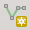
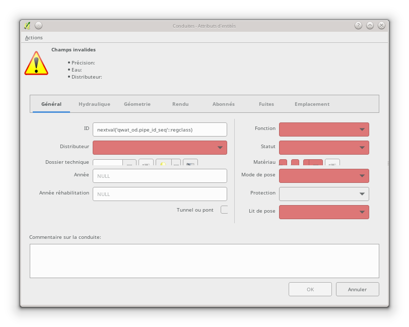
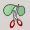
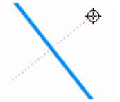

Création d’objets dans QWAT
===========================

Ce guide se veut un résumé des fonctionnalités de créations des données adaptées au besoin de QWAT dans QGIS.

Il ne saurait remplacer la lecture du `manuel <https://docs.qgis.org/2.18/fr/docs/user_manual/working_with_vector/editing_geometry_attributes.html>`_ de QGIS expliquant en détail les différentes commandes. Le dessinateur est libre d'utiliser les plugins de dessin pour enrichir sa palette d'outils.

Importation des points relevés
------------------------------

Pour importer des points dans QWAT, il faut cliquer sur l’icône « `EasyImport <https://github.com/VilleDePully/EasyImport>`_ »

.. image:: img/icon_plugin.png
 
La fenêtre suivante s’ouvre :

.. image:: img/dialog_esayimport.png

* Choisir le chemin du fichier à importer
* Choisir le bon réseau (EP‐ASS)
* Cliquer sur « Import »

Les points ont été importés dans les bonnes couches, ces dernières sont passées en mode édition.
Vous devez maintenant remplir les attributs des différents points pour chaque couche en suivant la marche à suivre.

Création des points de construction
-----------------------------------

Pour créer de nouvelles pièces d’installation il faut sélectionner la catégorie
« points de construction » qui est une sous‐couche dans la couche « Côtes ». 
Il faut ensuite basculer en mode édition

.. image:: img/icon_edit.png

et utiliser le bouton « ajouter une entité »

.. image:: img/icon_create_point.png

Il ne reste plus qu’à cliquer à l’emplacement du point voulu.
Le formulaire de l’objet s’ouvre, il n’y a aucun champ à remplir.
(Vous pouvez mettre une remarque éventuellement)
 

Création des conduites
----------------------

Pour créer de nouvelles conduites il faut sélectionner la catégorie « conduites »
qui est une sous‐couche dans la couche « Réseau ». Nous devons ensuite basculer en mode édition

.. image:: img/icon_edit.png

et utiliser le bouton «ajouter une entité»

Dessiner ensuite la conduite et faites un clic droit pour la valider
une fois tous les points de passage créés.
 
Le formulaire de la conduite s’ouvre.

Il faut remplir les champs suivants:

* Onglet Général
    * Distributeur
    * Année
    * Fonction
    * Statut
    * Matériau
    * Mode de pose
    * Protection
    * Lit de pose (matériau)
* Hydraulique
    * Qualité eau
* Géométrie
    * Précision
* Rendu
    * « Schématique » à cocher si on veut que la conduite apparaisse sur la schématique
* Fuites
    * Liaison avec les manchons de fuites à faire si besoin (cf partie sur les fuites)

Séparation d’une conduite en deux conduites
-------------------------------------------

Lors d’une mise à jour, il arrive régulièrement que l’on doive couper une conduite existante
pour se raccorder sur le nouveau point levé. Pour se faire, il faut utiliser l’outil « Séparer les entités »

Il faut ensuite faire une droite coupant notre conduite à l’endroit où l’on veut qu'elle soit coupée :

La conduite se coupe alors en deux conduites. Les champs n’ont pas besoin d’être complété,
la nouvelle conduite reprend les même attributs, le numéro d’ID de la conduite est créé automatiquement.

Création des différentes pièces d’installation
----------------------------------------------

Pour créer de nouvelles pièces d’installation il faut sélectionner la catégorie
« pièce d’installation » qui est une sous‐couche dans la couche « Nœuds ».
Il faut ensuite basculer en mode édition.

.. image:: img/icon_edit.png

et utiliser le bouton « ajouter une entité »

.. image:: img/icon_create_point.png

Il ne reste plus qu’à cliquer à l’emplacement du point voulu.
Le formulaire de l’objet s’ouvre, il faut remplir les champs suivants:

* Identification (numéro du point levé)
* Année
* Orientation (de la pièce)
* Type
* Statut

Création des points d’introduction
----------------------------------

Le point d’introduction se crée en créant une pièce d’installation ayant comme
« Type » = « point d’introduction ». Une fois cela fait, un point d’introduction sera
automatiquement crée dans la couche « Nœuds » lors de la génération des nœuds (voir les explications ci-dessous).

Création des vannes
-------------------

Pour créer de nouvelles vannes il faut sélectionner la catégorie « vannes » qui est une
sous‐couche dans la couche « Réseau ». Il faut ensuite basculer en mode édition

.. image:: img/icon_edit.png

et utiliser le bouton « ajouter une entité ».

.. image:: img/icon_create_point.png

Il ne reste plus qu’à cliquer à l’emplacement du point voulu.
Le formulaire de l’objet s’ouvre, il faut remplir les champs suivants:

* Onglet Général
    * Année 
    * Fermée (à cocher si c’est le cas)
    * Type
    * Fonction
    * Statut
    * Maintenance (si défaut)
* Géométrie
    * Altitude réelle (coordonnée Z du point)
    * Précision alti.
    * Précision (planimétrique)
* Rendu
    * Schématique à cocher si on veut que la conduite apparaisse sur la schématique

Création des bornes hydrantes
-----------------------------

Pour créer de nouvelles bornes hydrantes il faut sélectionner la catégorie « hydrantes »
qui est une sous‐couche dans la couche « Réseau ».

Il faut ensuite basculer en mode édition

.. image:: img/icon_edit.png

et utiliser le bouton « ajouter une entité ».

.. image:: img/icon_create_point.png

Il ne reste plus qu’à cliquer à l’emplacement du point voulu.
Le formulaire de l’objet s’ouvre, il faut remplir les champs suivants:

* Onglet Général
    * Année
    * Distributeur
    * Etat
    * Fournisseur
    * Souterraine (à cocher si c’est le cas)
* Géométrie
    * Altitude réelle (coordonnée Z du point) 
    * Précision alti. 
    * Précision (planimétrique)
* Hydraulique
    * Pression statique
    * Pression dynamique
    * Débit
    * Mesuré le
    * Mesuré par

Création d’un manchon de réparation
-----------------------------------

Pour créer un nouveau manchon de réparation il faut sélectionner la catégorie « fuites »
qui est une sous‐couche dans la couche « Réseau ».
Il faut ensuite basculer en mode édition

.. image:: img/icon_edit.png

et utiliser le bouton « ajouter une entité ».

.. image:: img/icon_create_point.png

Il ne reste plus qu’à cliquer à l’emplacement du point voulu.
Le formulaire de l’objet s’ouvre, il faut remplir les champs suivants:

* « réparée »
    * à cocher si la fuite est réparée
* détection
    * date de détection de la fuite
* adresse
    * endroit où a eu lieu la fuite
* Description
* Type
    * Type de dégâts
* Cause
    * Cause de la fuite
* Dommage
    * Gravité des dégâts
* « Conduite remplacée »  
    * à cocher si un bout de conduite a été changé
* Réparation
    * Pièce utilisée pour la réparation
* Date réparation

Pour que la liaison avec la conduite se fasse automatiquement, il faut enregistrer
la conduite une fois le manchon crée.

Création d’ouvrages ainsi que de tous leurs détails
---------------------------------------------------

Les ouvrages et leurs détails sont contenus dans plusieurs couches:

    * Le points principal se trouve dans la sous‐couche « ouvrage général »
    * Le couvercle de l’ouvrage, si il y en a un, se trouve dans la sous‐couche « couvercle »
    * L’emprise réelle de l’ouvrage se trouve dans la sous‐couche « ouvrage – polygones »
    * Les points de détail des ouvrages (par exemple les vannes d’une chambre de vannes) se trouvent dans la sous‐couche « détail ».

Création de l’ouvrage général
-----------------------------

Pour créer le point d’ouvrage, il faut sélectionner la catégorie « ouvrage général »
qui est une sous‐couche dans la couche « ouvrages ».  
Il faut ensuite basculer en mode édition

.. image:: img/icon_edit.png

et utiliser le bouton « ajouter une entité ».

.. image:: img/icon_create_point.png

Il ne reste plus qu’à cliquer à l’emplacement du point voulu.
Le formulaire de l’objet s’ouvre, il faut remplir les champs suivants:

* Nom (composé d’une lettre suivi d’un nombre)
* Statut 
* « Visible schéma » à cocher si on veut que la conduite apparaisse sur la schématique
* Année
* Type
 
Création du couvercle de l’ouvrage
----------------------------------

Pour créer le couvercle de l’ouvrage, il faut sélectionner la catégorie « couvercles »
qui est une sous‐couche dans la couche « ouvrages ».  
Il faut ensuite basculer en mode édition

.. image:: img/icon_edit.png

et utiliser le bouton « ajouter une entité ».

.. image:: img/icon_create_point.png

Il ne reste plus qu’à cliquer à l’emplacement du point voulu.
Le formulaire de l’objet s’ouvre, il faut remplir les champs suivants:

* identification (identique au champ « Nom » de l’ouvrage)
* Diamètre (en mm) 
* Altitude
* Type
* « Circulaire » à cocher si le couvercle est rond
* Ouvrage
    * Il faut lier l’ouvrage principal au couvercle. Pour se faire, cliquez sur le bouton
    
    .. image:: img/icon_link.png
    
    et ensuite aller cliquez sur le point principal de l’ouvrage (sur le plan).
    Le champ a du se remplir avec le nom de l’ouvrage.

Création de l’emprise de l’ouvrage
----------------------------------

Pour créer le point d’ouvrage, il faut sélectionner la catégorie « ouvrage général »
qui est une sous‐couche dans la couche « ouvrages ».
Il faut ensuite basculer en mode édition

.. image:: img/icon_edit.png

et utiliser le bouton « ajouter une entité ».

.. image:: img/icon_create_polygon.png

Il ne reste plus qu’à digitaliser l’emprise de l’ouvrage. Une fois le polygone crée, faites un clic‐droit pour arrêter la saisie.
Le formulaire s’ouvre, il faut remplir les champs suivants:

* name (identique au champ « Nom » de l’ouvrage)
* id_type 
* Year

Création des détails de l’ouvrage
---------------------------------

Pour créer les détails de l’ouvrage, il faut sélectionner la catégorie du détail voulu qui est une sous‐couche dans la couche « détail ».
Il faut ensuite basculer en mode édition

.. image:: img/icon_edit.png

et utiliser le bouton « ajouter une entité ».

.. image:: img/icon_create_point.png

Il ne reste plus qu’à cliquer à l’emplacement du point voulu.
Le formulaire de l’objet s’ouvre, il faut remplir les attributs selon
le type de détail que l’on a créé (réservoirs, sources etc..).

