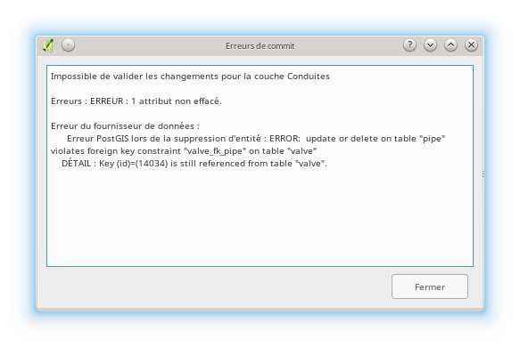

Suppression d’objets dans QWAT
==============================

.. warning:: Pour supprimer une conduite, il faut commencer par supprimer tous les points liés à cette conduite.

Les données étant liées en base, des erreurs peuvent survenir si les données amont n'ont pas été supprimées ou détachées au préalable:

Suppression des pièces d’installation / points d’introduction / vannes / bornes  hydrantes / manchons de réparation et conduites
--------------------------------------------------------------------------------------------------------------------------------

Commencer par aller sur la couche de l’objet que vous voulez effacer et basculer en mode édition.

Sélectionner ensuite le point avec l’outil de sélection. Vous pouvez soit faire une zone
de sélection ou tout simplement cliquer sur le point à effacer.

.. image:: img/icon_select.png

.. warning:: À ce moment, soyez attentif au fait de n'avoir que les points désirés à effacer, sinon tous les points sélectionnés seront effacés.

Pour voir quels objets sont selectionnés, il faut ouvrir la table d’attributs.

Un tableau s’ouvre. En bas à gauche de ce tableau se trouve une fenêtre à choix multiples
où il faut choisir « ne montrer que les entités selectionnées ». Il ne reste dans votre
tableau, normalement, que les objets que vous voulez effacer!

Si des objets supplémentaires apparaissent, cliquez sur le bouton « tout désélectionner »

Fermez le tableau et recommencez votre sélection.
Une fois que vous n’avez que les points à effacer de sélectionnés, cliquez sur le bouton « supprimer les entités sélectionnées ».

