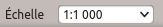
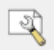
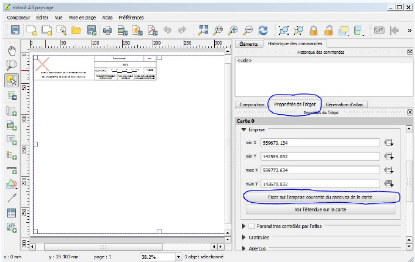
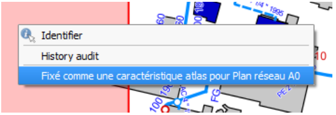

Impression dans QWAT
====================

Impression de plans divers
--------------------------

Pour imprimer une zone particulière, zoomer sur votre zone afin qu’elle soit entièrement visible à l’écran.
Ensuite, en bas à droite de QGis se trouve une fenêtre « Echelle ».

Choisissez l’échelle voulue à l’impression et recalez bien votre zone.

Cliquer ensuite sur le bouton « gestionnaire de composition »

La fenêtre ci‐dessous s’ouvre:

.. image:: img/print_composer_selector.png

Il faut ensuite sélectionner le format de page que l’on veut et de cliquer sur « Afficher ».
Une nouvelle fenêtre s’ouvre:

Cliquer sur l’onglet « Propriétés de l’objet » et sur le bouton « Fixer sur l’emprise courante du
canevas de la carte ». Votre plan est donc prêt à être imprimé!

Impression de plans réseau
--------------------------

Pour ce qui est des impressions selon le quadrillage pour nos plans « réseau » (A0),
il suffit de cliquer sur le bouton « identifier les entités »

Faites ensuite un clic‐droit dans la zone que vous voulez imprimer. Le tableau suivant s’ouvre:

Choisissez « Fixé comme une caractéristique atlas pour Plan réseau A0 », et vous aurez
encore une nouvelle fenêtre qui devrait s’ouvrir. Dans cette fenêtre se trouve votre
zone sélectionnée avec la page titre appropriée, il ne reste donc plus qu’à imprimer votre plan!

