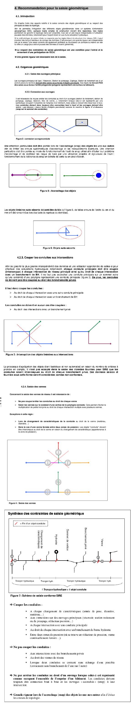

Structuration du réseau d’Eau Potable sur QWAT
==============================================

Ordre de saisie des différents type d’objets
--------------------------------------------

La mise à jour sur QWAT se fait dans l’ordre suivant:

* 1) Points de construction `qwat_od.node`, pour tous les:

    * points de construction
    * Té
    * Bouchon
    * Changement de matériau
    * Changement d’année
    * Changement de diamètre

* 2) Création des conduites `qwat_od.pipe`, pour toutes les:

    * Conduites principales (réseau)
    * Conduites hydrantes
    * Conduites de branchement
    * Conduites de branch. secondaire
    * Conduites de transport
    * Conduites d’arrosage

* 3) Création des pièces d’installation `qwat_od.vw_element_part`, pour tous les:

    * Croix
    * Changement de pente
    * Coude
    * Manchon
    * Collier de prise
    * Bouchon
    * Bouches d’arrosage
    * Autres pièces diverses

* 4) Création des points d’introduction, pour tous les: 

   * Points d’introduction

* 5) Création des vannes `qwat_od.valve`, pour toutes les:

    * Vannes réseau
    * Vannes hydrant
    * Vannes de prise
    * Vannes de prise secondaire
    * Vannes de régulation
    * Purge
    * Vannes de vidange automatique
 
* 6) Création des bornes hydrantes `qwat_od.vw_element_hydrant`, pour toutes les:
 
    * Bornes hydrant
 
* 7) Création des manchons de réparation, pour tous les:

    * Manchon de réparation

* 8) Création des ouvrages, pour tous les:

    * Ouvrages `qwat_od.vw_element_installation`
    * Couvercles `qwat_od.cover`

 
Directive de saisie des conduites   
---------------------------------

.. warning:: Cette partie est susceptible de changer en fonction du développement de QWAT. Le projet étant inité par les communes vaudoises (CH), elle se base sur les directives du SIRE. En la matière, il existe plusieurs numérisations possibles des réseaux d'eaux. Des modifications pourront être apportées suivant l'évolution du projet et des règles en vigueur.

La saisie du réseau doit être effectuée en respectant les directives fixées par SIRE, selon les exemples ci‐après.

